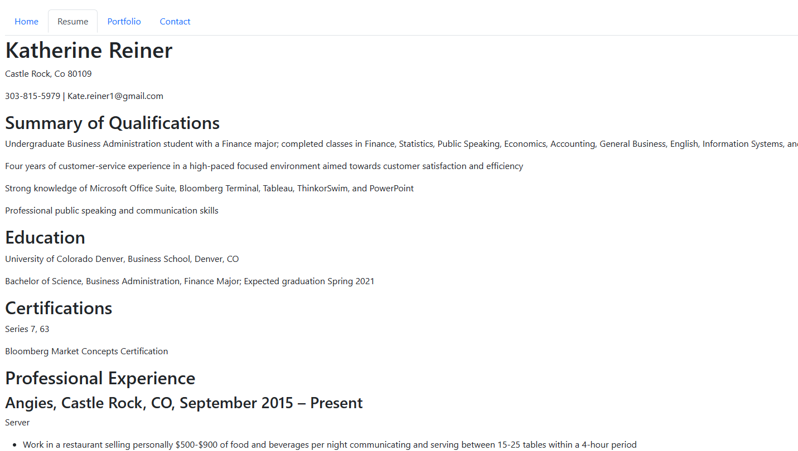
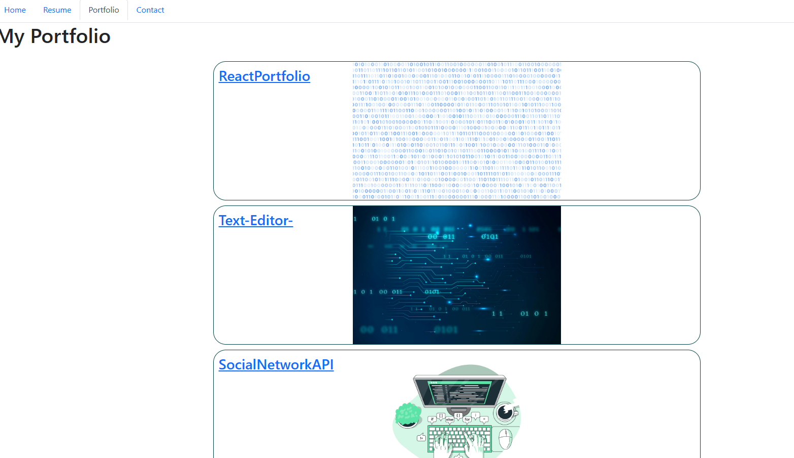

## React Portfolio

## Description
On this page, it provides links to past and current projects that show a variety of skills that use HTML, CSS, and JavaScript. This page is to be continiously updated to show any new projects that are underway on my Github repositories! Open this page to learn more about me and my career!

## Visuals

## Usage
This page is meant to be viewed on a desktop application. Its primary use is to be a landing page for current and future developments as well as contact information.

## Project status
The website is currently up to date. In the future about every 1-2 weeks additional links to more projects and developments can be found!

## Connect with Me!
- [Github Repo Link](https://github.com/reinerkp/ReactPortfolio)
- [Deployed Site Link](https://reinerkp.github.io/ReactPortfolio/)
